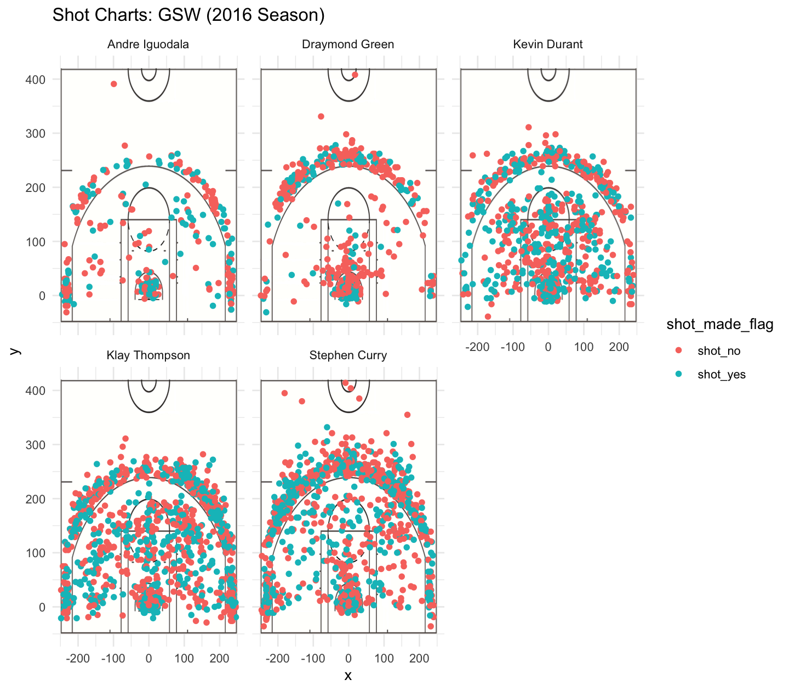

Workout 1
================
Grant Kalasky

Introduction
------------

### Motivation

It's undeniable that the Golden State Warriors have some of the greatest shooters in the NBA. During the 2016 season, the team's management revolutionized the NBA by investing heavily in a select number of players, all of which were high-performing shooters. This initially included Stephen Curry and Klay Thompson. Come 2016, the Warriors added Kevin Durant, who would later become another top-scoring Warriors player. Since their first, recent championship win in 2015, the team has been hailed as having the best roster of shooters in the league.

### Background

The statistics surely bolster this claim. The effective shooting percentage of the Warriors' top five players were all roughly around 50%, an noteably high percentage for a given player. It is even more significant when five players, all of which belong to the same team, can shoot with such proficiency and accuracy. Below, we'll explore the shooting data associated with the Warriors most talented players: Stephen Curry, Kevin Durant, Klay Thompson, Draymond Green, and Andre Iguodala.

Specifically, we will look at their Effective Field Goal Percentages (eFG%) for 3-point shots, 2-point shots, and overall percentages. The reason we chose to focus on this statistic is because it's a primary indicator of both a successful team and an individual player. The statistic's very definition allows us to define teams and players who produce the most value (scored points) for the team with each shot they take. The higher the metric, the more a team is effectively scoring each game. It also allows management and coaches to do quick, comparitive analysis of their opponents.

In addition to our analysis of the Warrior's eFG%, we will also explore some data visualizations that illustrate these players' shooting preferences (i.e. where they take their shots and which shots are "makes"), and how those behaviors affect their eFG%.

### Data

The shot data that we are using to conduct our analyses is collected from the 2016-2017 NBA Season. The dataset contains data pertaining to the five Warriors players mentioned in the Background section. The features of the data and their descriptions can be found in the data dictionary. However, some important features to note, and ones we use in our analyses, are the `shot_type` (2 PT or 3 PT Field Goal), `shot_made_flag` (whether the shot was a "make" or a "miss"), and `x` and `y` coordinate of where a given shot was taken during a game.

We load in the data below to be used for later analyses.

``` r
shots_data <- read.csv(file = "../data/shots-data.csv", stringsAsFactors = FALSE)
```

Analysis
--------

``` r
library(dplyr)
```


    Attaching package: 'dplyr'

    The following objects are masked from 'package:stats':

        filter, lag

    The following objects are masked from 'package:base':

        intersect, setdiff, setequal, union

We will first take a closer look at the Warriors 2-Point Effective Field Goal Percentages. To do this, we will filter our data only to instances in which players attempted a 2 PT field goal (`shot_made_flag == "2PT Field Goal"`). Since we only need the `name` of players and `shot_made_flag`, we'll only select these two features to conduct the remainder of our analysis.

``` r
two_point_shots <- filter(shots_data, shot_type=="2PT Field Goal")
two_point_shots <- select(two_point_shots, name, shot_made_flag)
```

We then group our data by each player and calculate the following statistics: - total: the total number of shots a given player took during the 2016-2017 season - made: the number of shots taken that were "makes" - percentage: the proportion of shots taken that were "makes"

``` r
two_point_perc <- summarise(group_by(two_point_shots, name),
                            total = sum(shot_made_flag=="shot_yes") + sum(shot_made_flag=="shot_no"),
                            made = sum(shot_made_flag=="shot_yes"),
                            percentage = made / total
                            )
two_point_perc <- arrange(two_point_perc, desc(percentage))
two_point_perc
```

    ## # A tibble: 5 x 4
    ##   name           total  made percentage
    ##   <chr>          <int> <int>      <dbl>
    ## 1 Andre Iguodala   210   134      0.638
    ## 2 Kevin Durant     643   390      0.607
    ## 3 Stephen Curry    563   304      0.540
    ## 4 Klay Thompson    640   329      0.514
    ## 5 Draymond Green   346   171      0.494

We use the same process to produce our analysis on players' 3-Point efG% and overall efG%:

``` r
three_point_shots <- filter(shots_data, shot_type=="3PT Field Goal")
three_point_shots <- select(three_point_shots, name, shot_made_flag)

three_point_perc <- summarise(group_by(three_point_shots, name),
                            total = sum(shot_made_flag=="shot_yes") + sum(shot_made_flag=="shot_no"),
                            made = sum(shot_made_flag=="shot_yes"),
                            percentage = made / total
                            )
three_point_perc <- arrange(three_point_perc, desc(percentage))
three_point_perc
```

    ## # A tibble: 5 x 4
    ##   name           total  made percentage
    ##   <chr>          <int> <int>      <dbl>
    ## 1 Klay Thompson    580   246      0.424
    ## 2 Stephen Curry    687   280      0.408
    ## 3 Kevin Durant     272   105      0.386
    ## 4 Andre Iguodala   161    58      0.360
    ## 5 Draymond Green   232    74      0.319

``` r
overall_point_perc <- summarise(group_by(shots_data, name), 
                                total = sum(shot_made_flag=="shot_yes") + sum(shot_made_flag=="shot_no"),
                                made = sum(shot_made_flag=="shot_yes"), 
                                percentage = made / total)
overall_point_perc <- arrange(overall_point_perc, desc(percentage))
overall_point_perc
```

    ## # A tibble: 5 x 4
    ##   name           total  made percentage
    ##   <chr>          <int> <int>      <dbl>
    ## 1 Kevin Durant     915   495      0.541
    ## 2 Andre Iguodala   371   192      0.518
    ## 3 Klay Thompson   1220   575      0.471
    ## 4 Stephen Curry   1250   584      0.467
    ## 5 Draymond Green   578   245      0.424

We also use the following code to produce our visualization of the Warriors' shooting preferences:

``` r
facetted_shot_chart <- ggplot(data=shots_data) +
  annotation_custom(court_image, -250, 250, -50, 420) +
  geom_point(aes(x = x, y = y, color = shot_made_flag)) +
  ylim(-50, 420) +
  ggtitle("Shot Charts: GSW (2016 Season)") +
  facet_wrap(~ name) +
  theme_minimal()
```



### Discussion

From the data above, it's clear that the Warriors have an all-star team, all of which can shoot incredibly well. From the graphic above, we see that Stephen Curry can shoot well beyond the 3-Point line. In fact, he prefers it. The majority of his attempted shots are 3-PT field goals. With a 3-Point eFG% of .407, Curry provides incredible value to the team. While this eFG% is not the highest on the team, he does take far more shots than his other teammates. Thompson, along with Curry, is another source of scored points for the Warriors. He's the only other player on the team who takes roughly the same number of shots as Curry, but has an even higher 3-Point eFG% of .424. Both of these players are dangerous to their opponents, even when they are far from the basket.

Closer to the basket, some other Warriors players stand out, particularly Andre Iguodala and Kevin Durant. Both players have noteably high 2-point eFG% statistics, both of which are above 0.60. Durant's shooting preferences are fairly split between close-up shots and shots behind the 3-Point line, but has high accuracy in both. Igoudala's shooting preferences are more interesting. He takes significantly less shots than the other four Warriors players, but maintains high accuracy close to the basket, as well as at the 3-point line. Another notable characteristic of Iguodala's shooting style is his sparse shot pattern. While it is sparse, his shots are fairly distributed throughout the court, showing that he is a talented and consitent shooter.

This shooting style underscores a larger trend with the Warriors top-performing players. While the team's top-five players have different shooting preferences in terms of location of shot, they all are statistically consistent. The number of shots that these players take from areas they are strongest in, whether it be close to the basket or back behind the 3-Point line, all players make nearly the majority of their shots (if not more). This is what makes the Warriors such a dominant team within the NBA.

### Conclusion

While other teams have a handful of talented shooters, they are rarely all playing at once. The Warriors five starting players are all high-performing shooters, making it extremely difficult for other teams to compete against them offensively. The Warriors' team management recognizes this and capitalizes on this strategy as they have brought on new players in the subsequent seasons. While they aren't investing as heavily in shooting-focused players, the team is beginning to invest more heavily in the weaker areas of the team, particularly their defense. If the Warriors management continues to stick to this strategy, the team will continue to be a powerhouse in the NBA for years to come.
